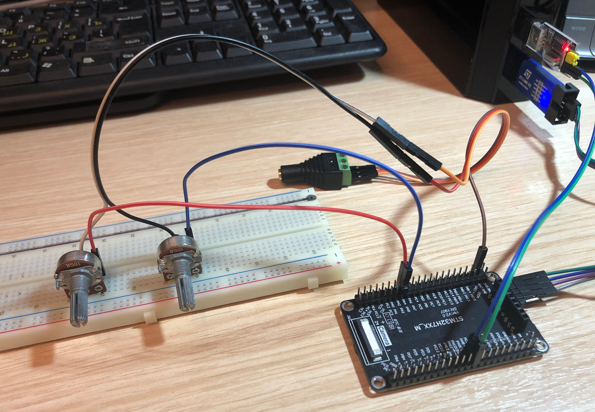

# UART-Synthesizer
A firmware for STM32H743VIT6 board to be an UART audio synthesizer and UART audio player.

## Hardware components
You will need the following hardware components to launch this synthesizer:
* STM32H743VIT6 evaluation board
* Personal computer (for Python frontend utility and audio processing with FFmpeg)
* USB-to-UART adapter with support for 2 MHz baudrate
* STlink 32-bit firmware programming device
* Audio speakers
* Spare cable for audio speakers with Left, Right and GND wires
* 200-500 Ohm trimmers and breadboard to plug them at (for low-impedance speakers only)

## Software components
* STM32 CubeH7 distribution v1.12.1 https://github.com/STMicroelectronics/STM32CubeH7
* STlink utilities v1.8.0 https://www.st.com/en/development-tools/st-link-v2.html
* arm-none-eabi-gcc v14.2.0 https://gcc.gnu.org/
* make v4.4.1 https://www.gnu.org/software/make/
* (optional) Visual Studio Code or similar IDE
* (optional) Cortex-Debug plugin for VSCode
* python v3.12.7 https://www.python.org/
    * Modules: os, sys, time, math, readline, wave, subprocess, multiprocessing, pyserial (as `serial`), tqdm
* pyserial v3.4 https://github.com/pyserial/pyserial
* tqdm v4.67.1 https://github.com/tqdm/tqdm
* FFmpeg v7.1 https://ffmpeg.org/

## Assembling
1. Connect USB-to-UART adapter to the 'H743. RX (adapter) -- pin PA9, TX (adapter) -- pin PA10
2. Connect STlink pins SWCLK, SWDIO, GND, 3.3V to the corresponding SWD pins on 'H743
3. Connect 'H743 pins to audio speakers: PA4 -- Left, PA5 -- Right, GND -- GND. In case of low-impedance speakers insert 200-500 Ohm trimmers inbetween (PA4 -- 200 Ohm -- Left, PA5 -- 200 Ohm -- Right, GND -- GND)
4. Plug STlink device and USB-to-UART adapter into your PC
5. Plug USB-to-UART adapter into your PC

Example setup (for low-impedance audio speakers):

## Running
1. Update `Makefile` with your `CubeH7` installation paths (as well as `.vscode/*.json` files for proper syntax highlighting when using VSCode)
2. Run `make` in the project's root directory to compile the firmware
3. Flash the firmware to 'H743 with `st-flash` utility or VSCode's graphical interface
4. Reset 'H743 by pressing reset button
5. Launch Python frontend with `python src/UART-Bridge.py`
6. Enter `help` to view available commands and their descriptions
7. Use tab-completions when typing commands
8. Type `exit` or `quit` to terminate Python frontend

## Further details

Additional information can be found in file 'Презентация.pdf' (not translated yet...)